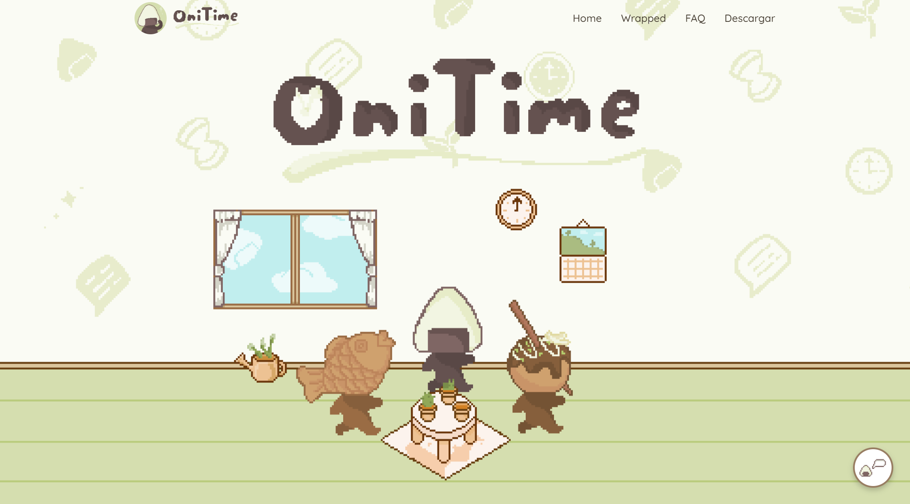
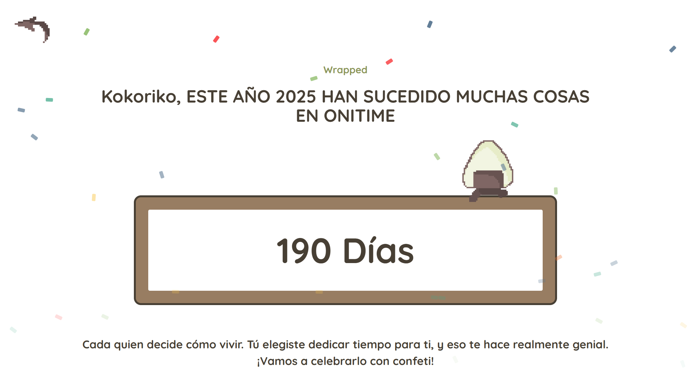

# OniTime Website

This repository contains the code for the official website of the [OniTime](https://github.com/KokorikoFC/TfgOnitime.git) app — a productivity tool designed to help users manage their time through visual analytics and interactive features.

## 🌐 Overview

The website provides detailed information about the app, a download option, and access to the personalized "Wrapped" experience — a visual summary of the user's activity within the app.

## 🚀 Technologies Used

- **Frontend:** `Angular` with `Motion.dev` animation library
- **Backend & Authentication:** `Firebase` (Firestore + Authentication)
- **Chat Assistant:** Integration using `Google Cloud` and `Docker`
- **Hosting:** `Firebase Hosting`

## 📂 Pages Structure

### 🏠 Home

- Main landing page with app information.
- Download button for the OniTime app.
- Includes a form where registered users can enter their credentials.
  If validated, they are redirected to the **Wrapped** page.

### 📊 Wrapped

- Displays a visual summary of the user's activity within the OniTime app.
- Accessible only after entering valid user credentials.

